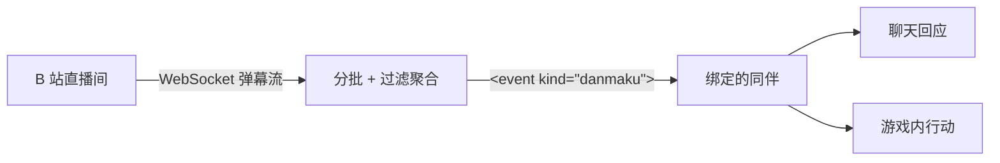

<div align="center">

# Numen Bilibili Bridge

**让 B 站直播间的弹幕,驱动 Minecraft 里的 AI 同伴**

[](https://www.minecraft.net/)
[](https://neoforged.net/)
[](https://fabricmc.net/)
[](https://adoptium.net/)
[](COPYING)

观众发一条弹幕「帮忙击败末影龙」——游戏里的同伴读懂它、列出计划、扛起装备出发。

</div>

---

## 它是什么

[Numen](https://github.com/Dwinovo/minecraft-numen) 是一个把 LLM 智能体放进 Minecraft 的 mod:同伴能聊天、寻路、挖矿、战斗、执行长任务。本 mod 是它的直播插件——把 B 站直播间的弹幕实时接进来,交给同伴阅读和回应。

心智模型只有一句话:**一个同伴负责一个直播间**。用 `/bilibridge bind` 把同伴和房间号配对,弹幕会按时间窗攒批、过滤聚合,再送到那个同伴的上下文里;它用自己的模型理解观众想要什么,然后用嘴回应、用手执行。

本 mod 自身不调用任何 LLM、不需要任何 API key、对直播间只读(不发言、不点赞)。



## 特性

- **弹幕直达同伴**:弹幕与醒目留言(SC)按秒/按条攒批,走 numen-api 事件通道送进同伴上下文,同伴立刻回应(可切换为安静模式,零额外 token)
- **多房间**:多个同伴各守一个直播间;多个同伴也可以共守同一间(共享一条连接)
- **token 防洪**:每用户限流、重复弹幕合并计数(`666 ×47`)、SC 置顶保留、行数上限截断——直播间刷得再疯,进模型的内容也被钉死在可预算范围内
- **零第三方依赖**:JDK HttpClient + WebSocket + zlib,JSON 用 Minecraft 自带的 Gson
- **断线自愈**:30 秒心跳、75 秒下行看门狗、host 轮换指数退避重连
- **协议自带文档**:B 站直播弹幕协议完整记录在 [docs/protocol.md](docs/protocol.md),不依赖任何外部文档存活

## 快速开始

**前置**:先安装 [Numen](https://github.com/Dwinovo/minecraft-numen)(numen-api 引擎内嵌在其 jar 中,本 mod 依赖它加载);Fabric 侧另需 [Fabric API](https://modrinth.com/mod/fabric-api)。

1. 把对应加载器的 jar 放进 `mods/`;
2. 进入世界,召唤一只同伴(给它配好模型);
3. 绑定直播间:

```
/bilibridge bind 小雪 92613
```

绑定即连接,并持久化保存——之后每次进世界自动重连。观众的弹幕会在 15 秒内攒成一批送给小雪,由它开口接话。

> 含中文或空格的同伴名在 `bind` 里需要英文双引号:`/bilibridge bind "小雪" 92613`。

多房间示例:

```
/bilibridge bind Nia 92613          Nia 守 92613
/bilibridge bind Momo 21452505      Momo 守另一间
/bilibridge bind Kiki 92613         Kiki 与 Nia 共守(共享连接,批次各收一份)
```

## 命令

| 命令 | 作用 |
|---|---|
| `/bilibridge bind <同伴名> <房间号>` | 绑定并连接;房间号写浏览器地址栏里的短号即可 |
| `/bilibridge unbind <同伴名>` | 解绑;房间没有其他绑定时自动断开 |
| `/bilibridge status` | 列出所有 房间↔同伴 配对、连接状态、攒批统计、下行心跳 |
| `/bilibridge test [同伴名] <文本>` | 离线注入一条假弹幕,走完整流程(零网络,调试用) |
| `/bilibridge window <秒>` | 批次时间窗,默认 15 |
| `/bilibridge max <条数>` | 触发发送的原始条数阈值,默认 50 |
| `/bilibridge lines <行数>` | 聚合后普通弹幕最多行数,默认 20 |
| `/bilibridge peruser <条数>` | 每用户每窗口保留最新几条,默认 1,0 = 不限 |
| `/bilibridge urgent true\|false` | 见下 |

**urgent 决定 token 花在哪**:`true`(默认)每批弹幕立刻唤醒同伴回应,消耗一次它的模型调用,适合直播互动;`false` 时批次安静进入上下文,随主人下一次对话一并送达,几乎不额外花钱,适合挂机旁听。

## 分批与节流

批次触发条件为「时间窗到期」或「原始条数到阈值」,先到先发。发送前每批经过四道流水线:

1. **每用户限流** —— 同一用户每窗口只保留最新 N 条,刷屏党自动消音;
2. **计数聚合** —— 文本归一化(全角半角、连续重复字符压缩)后相同的弹幕合并为 `文本 ×N`,刷屏热度以计数形式保留;
3. **SC 优先** —— 醒目留言不参与限流与聚合,置顶并标注价格;
4. **上限截断** —— 聚合后最多 `maxLines` 行,保留最新,末尾注明「另有 N 条略去」。

事件头部携带窗口时长与原始条数(如「30 秒内共 87 条弹幕」),同伴始终知道真实热度。

## 配置文件

`config/numen-bilibili-bridge.json`(命令改动自动保存):

```json
{
  "bindings": { "Nia": 92613, "Momo": 21452505 },
  "sessdata": "",
  "batchWindowSeconds": 15,
  "batchMaxCount": 50,
  "maxLines": 20,
  "perUserPerWindow": 1,
  "urgent": true
}
```

## 本地验证(不用开直播)

1. **绑别人的公开直播间** —— 只读观众视角,不登录不发言,拿真实弹幕流最方便;
2. **绑自己的房间号,自己发弹幕** —— B 站未开播也能在自己直播间网页发弹幕;
3. **完全离线** —— `/bilibridge test 主播好帅`,假弹幕走完整流程,零网络。

## FAQ

**Q:房间号在哪看?**
浏览器打开自己的直播间,地址栏 `live.bilibili.com/` 后面的数字就是。注意**个人主页的 UID 和房间号是两回事**,填错会连到别人的房间——`status` 显示已连接却永远收不到弹幕时,先检查这个。

**Q:为什么收到的用户名是打码的(`萝***`)?**
B 站对未登录连接的隐私策略:弹幕文本完整,发送者名字打码、uid 置 0。让同伴总结弹幕意图完全够用。在配置里填入自己账号的 `sessdata` 后可拿到真实用户名。

**Q:同伴不接弹幕怎么排查?**
`/bilibridge status` 依次看三处:连接状态是否 `CONNECTED`、`inbound` 是否在几十秒内(下行存活)、绑定的名字是否和同伴的名字完全一致。都正常的话,检查同伴的模型配置(设置 → 模型配置)是否可用。

**Q:观众能让同伴干活吗?**
能。弹幕和主人聊天走的是同一个大脑,同伴具备的能力(寻路、采集、战斗、建造)弹幕都能触发。它如何取舍听谁的,由你写的人设决定。

## 隐私

- 默认匿名连接,mod 对直播间只读:不发弹幕、不点赞、不做任何写操作;
- `sessdata` 可选,只随请求发给 `bilibili.com` 域名下的官方接口,不写日志、不发往任何其他地方。SESSDATA 等同于登录态,请勿把配置文件分享给他人。

## 构建

```
./gradlew :common:build :fabric:build :neoforge:build
```

产物在 `fabric/build/libs/` 与 `neoforge/build/libs/`。依赖的 numen-api 从 [numen-maven](https://github.com/Dwinovo/numen-maven) 解析;本地存在 sibling 目录 `../numen-maven` 时优先使用本地副本。

协议实现(`common/.../bili/`)不含任何 Minecraft 类,可独立复用;`ManualSmokeMain`(测试源集)可脱离游戏直连真实直播间联调。

## 路线图与已知限制

- [ ] 礼物(`SEND_GIFT`)、观看人数(`WATCHED_CHANGE`)等更多消息类型
- [ ] 抖音直播间(独立模块)
- 服务端下发 brotli 帧(协议版本 3)时记日志并丢弃;声明 protover 2 后正常只会收到 zlib
- 绑定的同伴不在世时该房间的批次丢弃,聊天框对每段缺席只提示一次

## 许可

[LGPL-3.0-only](COPYING),与 Numen 一致。
